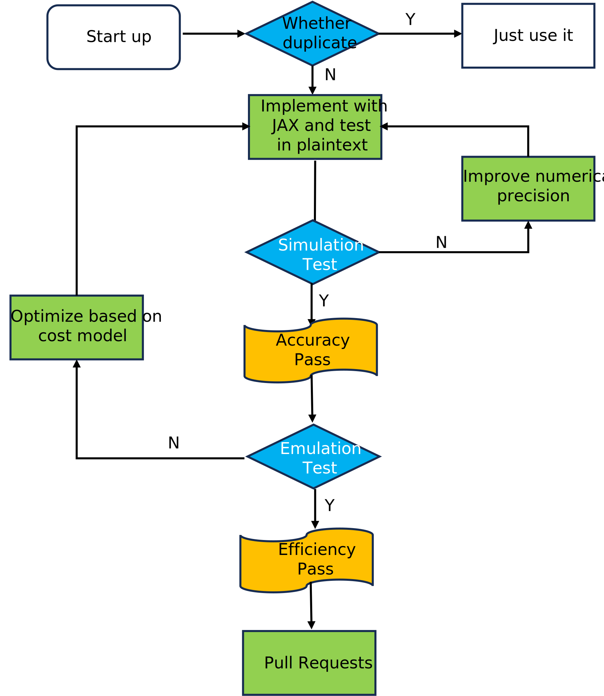

# Development

We welcome developers of all skill levels to contribute their expertise.
There are many ways to contribute to SML including reporting a bug, improving the documentation and contributing new algorithm.
Of course, if you have any suggestion or feature request, feel free to open an [issue](https://github.com/secretflow/sml/issues).

## Submitting a bug report

If you want to submit an issue, please do your best to follow these guidelines which will make it easier and quicker to provide you with good feedback:

- Contains a **short reproducible** code snippet, so anyone can reproduce the bug easily
- If an exception is raised, please provide **the full traceback**.
- including your operating system type, version of JAX, SPU(or commit id)

## Contributing code



> 1. To avoid duplicating work, it is highly advised that you search through the issue tracker and the PR list.
> If in doubt about duplicated work, or if you want to work on a non-trivial feature,
> it's **recommended** to first open an issue in the issue tracker to get some feedbacks from core developers.
> 2. Some essential [documents](https://www.secretflow.org.cn/docs/spu/latest/en-US) about SPU are highly recommended.

The preferred way to contribute to SML is to fork the main repository, then submit a "pull request" (PR).

1. Create a GitHub account if you do not have one.
2. Fork the [project repository](https://github.com/secretflow/sml), you can refer to [this](https://docs.github.com/en/get-started/quickstart/fork-a-repo) for more details.
3. Develop the feature on **your feature branch** on your computer, using [Git](https://docs.github.com/en/get-started/quickstart/set-up-git) to do the version control.
4. Follow the instructions in [Before Pull Request](<./CONTRIBUTING.md#Before Pull Request>) to place or test your code, then create a pull request from your fork using [these instructions](https://docs.github.com/en/pull-requests/collaborating-with-pull-requests/proposing-changes-to-your-work-with-pull-requests/creating-a-pull-request-from-a-fork).
5. Committers do code review and then merge.

## Before Pull Request

When finishing your coding work, you are supposed to do some extra work before pulling request.

1. **Make sure your code is up-to-date**: It is often helpful to keep your local feature branch **synchronized** with
the latest changes of the main sml repository.
2. **Place your codes properly**: Generally speaking, for every algorithm, at least 3 files are needed
   - `<algorithm>.py`: implementation of algorithm or new features, it should be a **"jit-able"** program that runs correctly in plaintext (same or near to output from scikit-learn).
   - `<algorithm>_test.py`: a pytest test file, in which you test your program with **simulator**, then you should report the behavior (like correctness or error rate) under MPC setting.
   - `<algorithm>_emul.py`: similar to the above file, except you will test program with **emulator**, then you can get a sense of efficiency under different MPC protocols.
3. **Other things**: there are still some small fixes to do.
   - **Add necessary doc**: your implementation may only have part features, or some changes have been made due to limitations of both JAX and SPU, you **MUST** describe these things explicitly!
   - **Code quality and formatting**: The project uses pre-commit hooks to automatically maintain code quality:
     - **Pre-commit hooks**: Run automatically on each commit to check and fix common issues
     - **Black**: Automatically formats Python code for consistent style
     - **isort**: Sorts and organizes import statements
     - **autoflake**: Removes unused imports and variables
     - **Other checks**: Trailing whitespace, file endings, YAML/TOML syntax, debug statements
     - Manual formatting: If needed, you can also run `black` and `isort` manually on your files
     - Run all checks: `pre-commit run --all-files` to check all files at once

## Code Quality Automation

The project includes pre-commit hooks that automatically run code quality checks and formatting on every commit:

- **Automatic setup**: Pre-commit hooks are already installed and configured in the repository
- **What it does**: Automatically formats code (Black, isort), removes unused imports (autoflake), checks file quality, and detects common issues
- **Usage**:
  - Hooks run automatically on `git commit`
  - Manual run: `pre-commit run --all-files`
  - Skip hooks (not recommended): `git commit --no-verify`
- **Benefits**: Ensures consistent code style, catches issues early, reduces manual formatting work

**📖 For detailed information about all pre-commit tools and their configuration, see [docs/pre-commit-tools.md](./docs/pre-commit-tools.md)**

If hooks fail during commit, fix the reported issues, stage the changes (`git add .`), and commit again.

## Advanced Topics

### Reveal some data during your programs

First and foremost, it is important to emphasize that revealing data in plaintext is a risky operation. You must be fully aware of the potential data leakage risks associated with this action.
If you still need to reveal some data from the SPU, you can use the `sml_reveal` function defined in `sml/utils/utils.py`, which allows you to reveal one or more arrays as plaintext.

#### How to use the revealed values

Note that the data revealed in your program will still be in the form of arrays, and you must ensure that your program remains fully jitable.
Therefore, you **cannot** use standard Python control flow statements (such as if-else or while loops); instead, you should use JAX's control flow constructs.

**CASE 1**: Conditional judgment on revealed data

```python

def reveal_func_single(x):
   # We assume the input `x` is an 1-d array
    y = jnp.log(x)
    # reveal single value
    xx = sml_reveal(x)

    # x is 1-d array, so we fetch the first element
    pred = xx[0] > 0

    def true_branch(xx):
        return jnp.log(xx), True

    def false_branch(xx):
        return jnp.log(-xx), False

    # use jax.lax.cond to replace if-else
    yy, preds = jax.lax.cond(pred, true_branch, false_branch, xx)

    return y, yy, preds
```

**CASE 2**: Use revealed data to determine while loop exit

```python
def reveal_while_loop(x):
    y = sml_reveal(jnp.max(x))

    def cond_fun(carry):
        _, y = carry
        # jnp.max return 0-dim array, so we can fetch y directly
        return y > 3

    def body_fun(carry):
        x, _ = carry
        new_x = x - 1
        new_y = sml_reveal(jnp.max(new_x))
        return new_x, new_y

    x, _ = jax.lax.while_loop(cond_fun, body_fun, (x, y))

    return x

```

For concrete usage of the two examples above, please refer to `tests/utils/reveal_test.py`.

Finally, in `sml/linear_model/logistic.py`, we have also implemented a simple early stopping mechanism based on parameter changes (as a practical application of `while_loop`). This allows for more efficient logistic model training by revealing only a few bits, which can be considered to have very limited information leakage.
